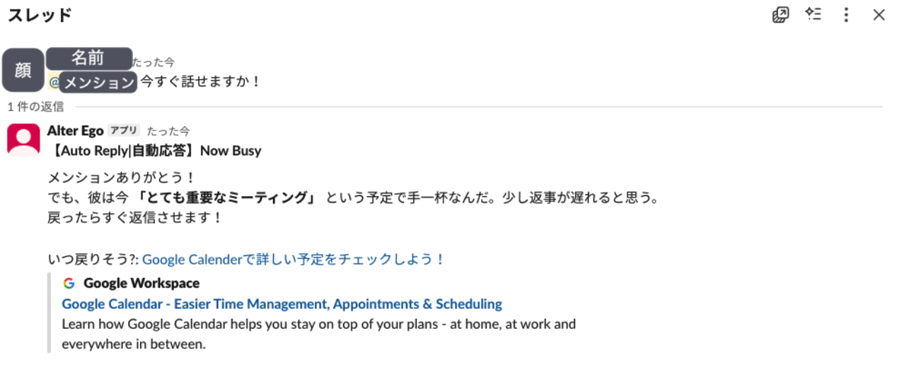

## Overview
* Our team has a culture of responding immediately to reviews and inquiries.
* While that is a good thing in itself, my colleagues are constantly multitasking—responding regardless of whether they are in a meeting or not.
* I am not particularly good at that, and the frequent task switching has always been a major headache for me.
* I wished there was a system that would just "post a quick note automatically based on my Google Calendar status."
* Thus, the "Secretary Bot" that automatically responds based on Google Calendar was born.

## Example notification

## Architecture
Built using Slack App + GAS (Google Apps Script).
I considered using [Make](https://apps.make.com/slack), but I ultimately chose GAS considering future scalability and the limitations of free-tier plans.

### Create Slack App
1. Access [Slack API: Apps](https://api.slack.com/apps) and click "Create New App."
2. Select "From scratch," enter the App Name, and select the target Workspace.

#### Grant Permissions
3. In the "OAuth & Permissions" menu on the left, add the following to "Bot Token Scopes" under the Scopes section:
* `channels:history`
* `chat:write`

#### Define Bot User
This step might already be configured by default. If so, you can skip it.

4. Click "App Home" in the left sidebar.
5. Click the "Edit" (or "Review") button under the "Your App's Presence in Slack" section.
6. Enter the "Display Name" (the name displayed on Slack) and "Default username" (ID in lowercase), then save.

#### Install to Workspace
7. Return to the "OAuth & Permissions" menu and click "Install to Workspace" under OAuth Tokens, then click "Allow."
8. Copy the displayed "Bot User OAuth Token" (the one starting with `xoxb-`).

### Create Bot Logic with GAS
1. Open Google Apps Script and create a "New Project."
2. Implement and save the following code:
    a. Set the "Bot User OAuth Token" obtained in the previous step.
    b. Set your own Mention ID.
3. Click "Deploy" → "New deployment" at the top right of the GAS screen.
4. Select "Web App" under Select type (gear icon).
      * Settings:
        * Description: Optional (e.g., initial deploy)
        * Execute as: Me
        * Who has access: Anyone (*To receive requests from Slack)
5. Deploy and copy the generated "Web App URL."

### Subscribe to Bot Events
You need to subscribe to the events in the Slack App settings so it can process messages via GAS.
The steps are as follows:

#### Subscribe Events
1. Return to the Slack API management screen and select "Event Subscriptions" from the left menu.
2. Switch "Enable Events" to ON.
3. Paste the copied GAS URL into the "Request URL" field (It is successful if "Verified" appears).
4. Under "Subscribe to bot events" at the bottom, add `message.channels`.
5. Click "Save Changes."
6. You will be prompted to reinstall the app; click the link to reinstall it.

### Preparation
1. Invite the created Slack App bot to the channels where you want it to respond.
2. Register your schedule in Google Calendar. If there are no events scheduled at the time you are mentioned, the bot will not respond.